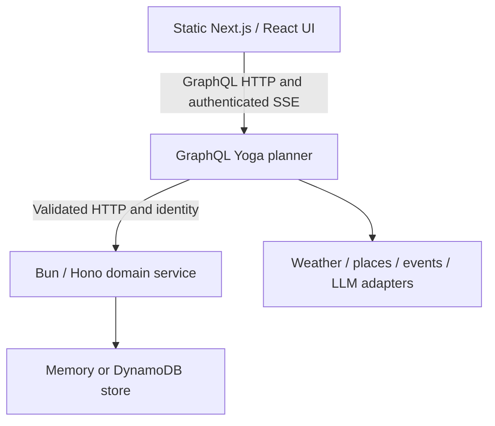

# Architecture

Wander demonstrates a trip-planning journey through a static browser app, an aggregation service and a domain service. The default uses deterministic outside providers and local memory storage, while preserving the real UI → GraphQL → REST boundaries. Installed dependencies and local processes are prerequisites; no cloud account or external vendor connection is required at runtime.

## Responsibility boundaries

REST owns versioned trips, days, activities, preferences and sharing. Domain invariants, ownership and conditional writes remain true regardless of the planner. Zod schemas validate requests and produce OpenAPI; memory and DynamoDB adapters implement the same store contract. GraphQL does not access the domain database directly.

GraphQL owns client-shaped reads and orchestration. Request-local DataLoader batches REST fan-out; planning combines weather, places, events and LLM ports. Deterministic mock adapters default on. Real OpenAI, Anthropic, wttr, Overpass and Ticketmaster adapters are selected independently and require only selected inputs. Provider failures are normalized at adapter boundaries. The benefit is vendor replacement without rewriting the domain API; the cost is an additional service and network hop.

React owns planning, progressive display, refinement, pin/swap, saved trips and public sharing. urql uses generated operations from committed SDL. Next exports static files; Tailwind provides styling, MDX compiles committed documentation and Sharp generates local image variants. Vite is the component-test transform, not the app bundler. The browser sends all application requests to GraphQL.

The hub owns Compose, foundation CDK, release orchestration and teaching references. Service-specific ECS and static-hosting stacks live beside their services. Foundation supplies networking, Cognito, DynamoDB, ECR, S3 and deploy-time SSM outputs; task roles and selected provider secret references remain scoped. The UI uses a private S3 origin with CloudFront OAC. Deployment code and offline assertions are implemented; cloud resources are not claimed to be deployed.

## Identity, streaming and observability

Demo identity is explicit (`Bearer demo`). Live API composition verifies Cognito access tokens and never substitutes demo auth. Browser sign-in uses a public app client with PKCE; access tokens stay in memory and sign-out clears identity caches. Public sharing returns a read-only projection.

GraphQL generations return an ID, emit ordered events and permit replay/late subscription within the same process. Completion, cancellation and deadlines are tested. Restart loses pending generations and replay state. A single graph task with stop-before-start deployment avoids accidentally routing subscriptions across independent buffers; durable recovery or scaling requires shared coordination.

Memory trips disappear on REST restart. DynamoDB Local demonstrates the durable-store contract when the emulator is available. APIs emit OpenTelemetry traces, metrics and correlated structured logs; export defaults off. Collector/New Relic routing and scrubbed Sentry browser reporting are optional and live-unverified. No notification or hosted automation is enabled by default.

## Verification boundary

Vitest contracts and bound-server integration exercise domain, planner, auth failures, batching and stream lifecycle. Playwright drives the built three-service journey. Drift checks cover REST OpenAPI, GraphQL types/SDL, UI docs and image snapshots. Four CDK apps synthesize with fake inputs and no account calls. Docker acceptance separately requires actual image builds, clean Compose startup, smoke, the DynamoDB contract and volume persistence. A missing prerequisite is recorded as pending, never inferred from source code. GitHub templates remain outside active workflow discovery.
