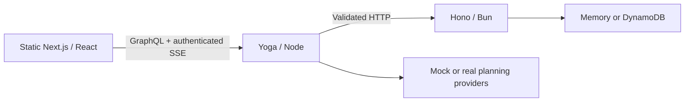

# Architecture

Wander separates the browser, orchestration and domain layers through typed interfaces.

| Layer   | Owns                                                                          | Main trade-off                                               |
| ------- | ----------------------------------------------------------------------------- | ------------------------------------------------------------ |
| UI      | Interaction, generated urql operations, PKCE, static MDX/images               | Public configuration is fixed at build time                  |
| GraphQL | Client-shaped reads, DataLoader, provider orchestration, generation lifecycle | Process-local jobs require one task; restart interrupts work |
| REST    | Domain rules, ownership, conditional writes, share projections, OpenAPI       | Extra HTTP hop keeps persistence separate from planning      |
| Hub     | Compose, shared CDK foundation, release tooling                               | Four independent repositories need compatible revisions      |

Defaults use mock providers, demo identity and memory, with reporting off. Live APIs verify
Cognito access tokens; the browser uses a public PKCE client. Public shares return read-only
projections. REST memory resets on restart; DynamoDB persists trips but not graph jobs.

AWS infrastructure is foundation → REST Fargate → graph Fargate → static S3/CloudFront OAC.
Graph is publicly routed through HTTPS; REST and tasks stay private. The UI owns the bucket's
single OAC policy. OpenTelemetry and Sentry are opt-in. Vitest, API integration, Playwright and
CDK assertions cover boundaries locally; Docker and account-backed acceptance are separate.

Next builds the static application, Vite transforms tests, Sharp generates images, and MDX
compiles the planning guides. There is no request-time Next server or direct UI → REST path.
